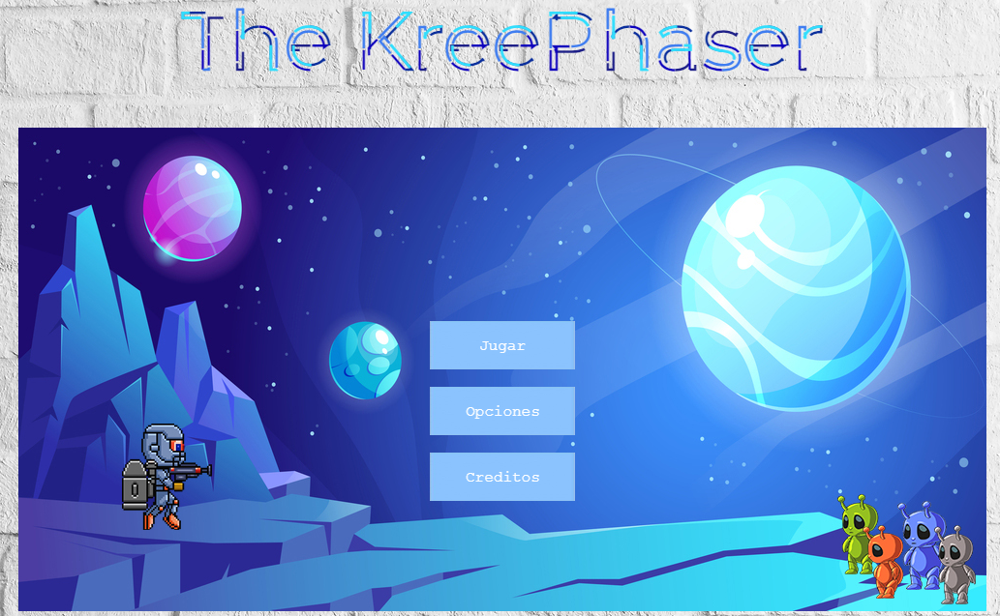
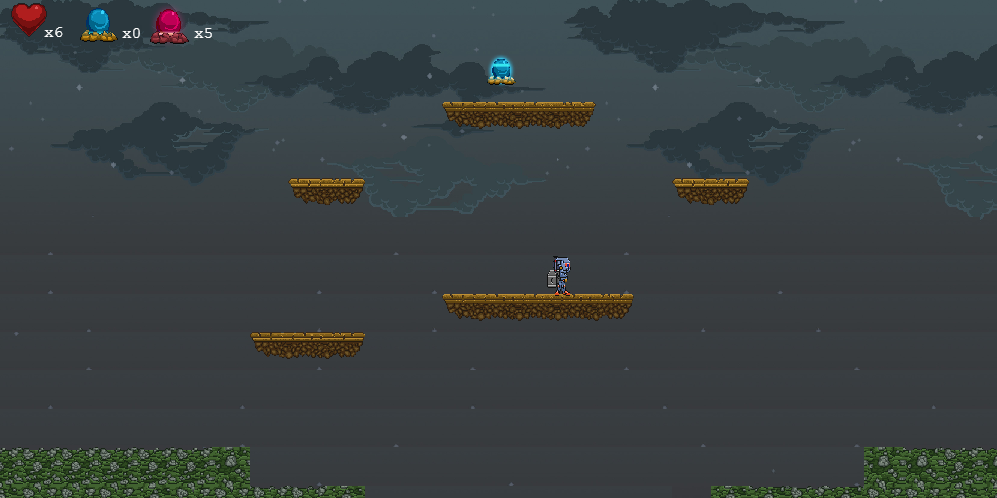
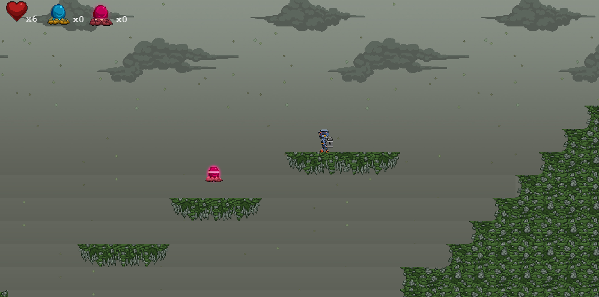
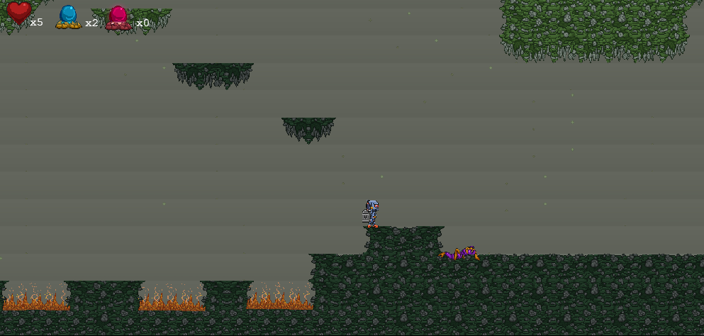
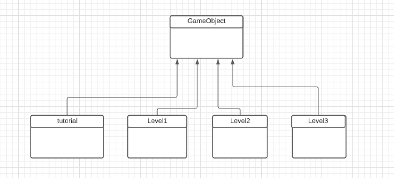
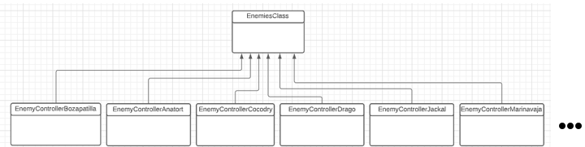
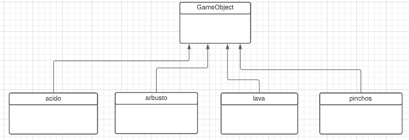
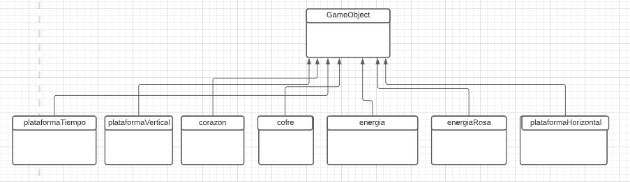

# THE KREEPHASER

Numero de grupo 2 (THE KREEPHASER)

## Pantalla del juego

## Enlace al juego
https://tolu9660.github.io/DVI/

# GDD

#### Título:  
The Kreephaser
#### Motor gráfico: 
Pagina web desarrollado con Phaser 3
#### Estilo gráfico: 
2D	
#### Género: 
Plataformas
#### Público: 
Para todos los públicos
#### Plataforma: 
Pc
#### Versión: 
1
#### Sinopsis de Jugabilidad y Contenido: 
Vivir la experiencia en distintos mundos de plataformas,  en donde tendrás que usar una llave para rescatar a los distintos miembros de la familia, y reunirlos a todos

#### Historia
Todos los miembros de una familia han sido secuestrados por un alienigena. El padre de esta familia debera recorrer los distintos mundos donde se encuentran sus familiares para salvarlos. El protagonista debera enfrentarse a multitud de enemigos y trampas que le intentaran impedir su avance.
 
#### MECÁNICA DEL JUEGO 
##### Mover
Haciendo uso de los controles del teclado el jugador se podrá mover lateralmente sobre el suelo. El jugador haciendo uso de los controles podrá decidir la dirección de movimiento del personaje. El jugador deberá hacer uso de otras mecánicas debido a qué en los distintos niveles se encontrará con obstáculos qué impedirán su avance.

##### Saltar: 
El personaje se impulsará hacia arriba  con un salto al pulsar el botón correspondiente. El personaje debe volver a tocar una superficie para realizar el movimiento de salto.

##### Doble Salto:
El personaje puede hacer un salto en el aire tras un salto realizado con la tecla correspondiente. El personaje solo podra hacer el doble salto si tiene en su inventario como minimo una celula de energia.

##### Dash:
El personaje puede hacer un dash pulsando el boton correspondiente siempre que este realizando un desplazamiento lateral sobre el suelo.

##### Atacar
El personaje podrá atacar a los enemigos de dos maneras. Saltando sobre ellos y utilizando la pistola. Estos ataques no producen daño sobre los objetos del juego, por lo qué no podrá usarlos para romper plataformas y obstáculos qué no sean enemigos. El disparo de la pistola hara daño 1 si se trata de un disparo normal y 2 si se trata de un disparo potenciado. El disparo potenciado solo estara disponible si tiene gemas en su inventario.

##### Interactuar
El personaje podrá interactuar con 5 objetos distintos. Los cuales serán los corazones, las células de energía, cofres los cuales te puede tocar de forma aleatoria (gema, celula de energia y corazones) las gemas y las llaves. La recogida de estos objetos será automática por lo qué el jugador no tendrá la necesidad de pulsar ningún botón.

##### Pausar el juego
Al pulsar el botón de pausa (tecla ESC) del juego, toda acción se paralizará. Aparecerá un menú con estas opciones:  
   Reanudar partida
   Reiniciar partida
   Configuración de sonido
   Configuración de musica 
  Salir 

##### Reglas básicas
The Kreephaser como todo juego tiene sus propias reglas. A continuación estableceremos las condiciones de victoria y derrota.
##### Condiciones de victoria y derrota
La derrota ocurrirá cuando el jugador pierda todas las vidas. La pérdida de vidas puede ocurrir debido al daño producido por un enemigo o por la caida en alguna de las trampas.
La victoria ocurrirá cuando el jugador supere todos los niveles del juego recuperando a todos sus familiares y haya derrotado al jefe final. El jefe final se encuentra en el último nivel del videojuego. 

##### Logros
Cada vez que avanza los niveles, obtiene el logro de poder recuperar a un miembro más de su familia.

#### PERSONAJES
En The kreephaser no hay posibilidad de elección del jugador. El protagonista siempre será el padre de la familia.

#### Controles
Usa las flechas < > laterales para mover al jugador
Usa la flecha ^ para realizar un salto
Usa la tecla ESPACIO para realizar un disparo 
Usa la tecla E para realizar un doble salto (solo si tienes celulas de energia y estas en el aire)
Usa la tecla D para realizar un dash
Usa la tecla C para realizar un disparo potenciado (solo si tinees gemas)

#### Vadum
Vadum es el marido y padre de una familia la cual ha sido secuestrada por unos enemigos. El protagonista de esta historia debe recorrer cada uno de los mundos adquiriendo las llaves necesarias para recuperar a cada miembro de su familia. En su recorrido se enfrentará a distintos enemigos con multitud de habilidades, Vadum podrá usar su pistola de plasma siempre y cuando obtenga gemas podra usar el disparo potenciado.

|    **Nombre**       |  **Daño**  |  **Vida**   |   **Nivel**   |                                       **Imagen**                                          |
|---|---|---|---|---|
|    **Vadum**       |   1-2  |   6     |   Todos   | |
                                                                             

#### ENEMIGOS

En cada nivel de juegos nos encontraremos diferentes enemigos propios de cada mundo.

|    **Nombres**      |                                       **Imagen**                                         |
|---|---|
|    **Jackal**       |      |
|    **Shangheli**    |      |                                                 
|    **Grunt**        |  |
|    **Sapien**       | |                                                
|    **Drago**        |      |                                                 
|    **Ralp**         |     |                                             
|    **Galrado**      |        |                                              
|    **Añatort**      |        |                                                 
|    **Cocodry**      |        |                                                 
|    **Lobeznotird**  |        |                                                 
|    **Marinavja**    |         | 

#### Objetos
1. Corazon: Este objeto le dará al jugador la capacidad de recuperar una vida por cada corazón recogido.
2. Celula de energia: Este objeto de color azul dará al jugador la posibilidad de realizar un doble salto.
3. Gema: El jugador podrá encontrar gemas rosas las cuales usara para poder realizar el disparo potenciado.
4. Llave: En cada nivel el protagonista deberá recoger la llave y es necesario para qué el personaje recupere a cada miembro de su familia.

### Resumen de dirección artística
En todos los niveles se usa el mismo fondo con una paleta distinta de colores pero en todos se usa una gama de colores oscura. Cuando el jugador baja en los mapas que tienen cuevas se usan las mismas texturas que en la superficie pero con colores mas oscuros para representar lugares con poca iluminación.

#### Tutorial

#### Nivel 1

#### Nivel 1 Zona Cueva

### Arquitectura software del juego (UML o similar)

### Breve descripción del sistema y plataformas de comunicación

1. Discord: Para las reuniones que el equipo organizaba cada dos semanas.
2. Whatsapp: Para organizar las reuniones y la comunicación habitual.
3. GitHub: Para llevar un control, cada uno tenía su rama en la que hacer sus cambios y la rama main en la que unir todos esos cambios.
4. Drive: Para hacer y guardar las presentaciones de los distintos Hitos.  

### Informe de pruebas
Los usuarios que han probado el juego han sido los padres de uno de los miembros del equipo que no son jugadores habituales de PC y un amigo de este mismo miembro el cual si que es jugador habitual de PC.

Los tres usuarios pasan de largo de los enemigos que no les impiden el paso sin pelear con ellos.
- La posible solución a esta situación seria haciendo que al matar a un enemigo este suelte un objeto al azar. De esta manera podemos hacer que lso usuarios tengan un incentivo a enfrentarse con los distintos enemigos.

Los usuarios al no conocer el daño que hacen las trampas(matan al instante), se les notaba un tanto molestos ya que debian empezar de nuevo.
- Esto se podría solucionar reduciendo el daño de las trampas o habilitando un punto de control en el que aparecer sin tener que iniciar de nuevo.

Al recolectar las gemas sumaban demasiadas al inventario por lo que no se les acababa dando uso en el nivel.
- Esto se pudo solucionar reduciendo el numero de gemas que adquiria el usuario.

Los usuarios en algunos momentos se les veia algo perdidos debido a que las texturas eran muy grandes y el usuario no podia ver lo que había por delante o por debajo. Eso unido a lo comentado de las trampas generaba un estado de incertidumbre por parte de los usuarios.
- Esto se puede solucionar reduciendo las texturas o haciendo que la camara capte mas zona del juego.

Los mapas son grandes y con diferentes alturas por lo que los usuarios tenian que recorrer muchas partes del mapa sin saber si ya habian pasado por ahi. Esto unido a la poca parte del mapa que capta la camara crea un problema para llegar a encontrar la llave.
- Una solucion a esto podria ser poner pequeñas señales que lleven hasta la llave y la cueva o hacer el mapa en uno o dos niveles unicamente para que no se vuelva un laberinto para el usuario. 

Hay zonas de los ultimos niveles donde los usuarios con poca experiencia no lograban pasar por ciertas zonas y tenian que dar la vuelta para pasar por otro lado.
- Podemos mantener esos niveles de dificultad en ciertas zonas pero al ser algo mas complicadas debemos dejar otras zonas de paso para los usuarios con poca experiencia. Pero estas zonas las mantendriamos debido a que ciertos usuarios podrian intentar pasar por esas zonas a modo de "reto".

Los usuarios han encontrado bugs con algunos objetos animados a lo largo de los uno de los participantes a comentado que el muñeco podria desplazarse mas deprisa. Por esto y todo lo comentado anteriormente al juego aun le quedan cosas que pulir y solucionar.

#### MIEMBROS DEL EQUIPO

|Nombre                       | Diseño | Gestion | Arte | Comunicación | Implementación |
|---|---|---|---|---|---|
|Jesús Vélez Ayuso            |   22   |    25   |  10  |      25      |       40       |
|Álvaro Gómez Morán           |   30   |    20   |  30  |      25      |       20       |
|Luis Gabriel Román Santillán |   22   |    30   |  25  |      25      |       20       |
|David Domínguez Gutiérrez    |   26   |    25   |  35  |      25      |       20       |
